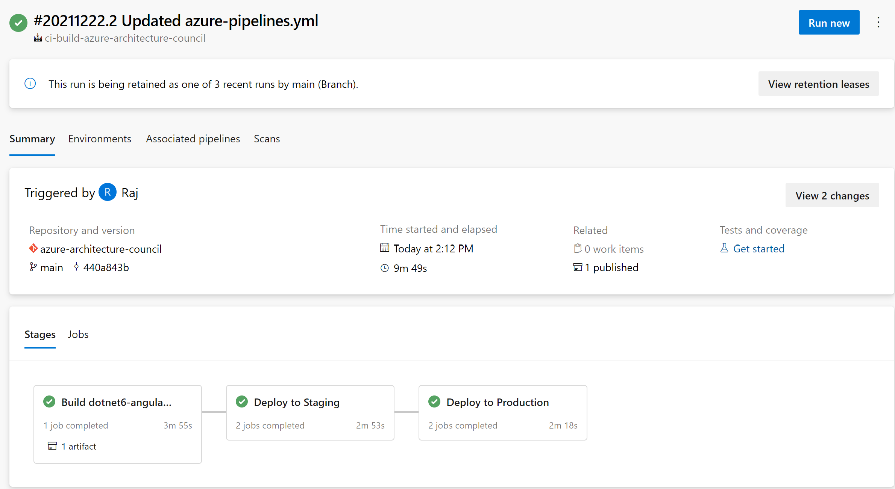

# Azure Multi Stage Pipeline Automation 

This repository explains the deployment scenario of the [reference architecture](https://docs.microsoft.com/en-us/azure/architecture/example-scenario/devops/automate-azure-pipelines) published in azure architecture center. It contains the following building blocks

- `dotnet web project with angular front end` - Example Workload to demonstrate pipeline automation
- `azure resource group deployment project` - Infrastructure as Code to deploy the example workload
- `azure-pipelines yaml` - pipeline definition with the steps required to build and deploy the example workload

# Pre-Requisites

- Please follow the steps to deploy the [`azure-logic-app`](https://github.com/mspnp/multi-stage-azure-pipeline-automation) first.
- This will orchestrate the provisioning of multistage pipelines within your `azure-devops` project
- Create a [service connection](https://docs.microsoft.com/en-us/azure/devops/pipelines/library/service-endpoints?view=azure-devops&tabs=yaml) from azure devops to your azure subscription 
- Change the `parameters file` in the `deployment` project to match your resource naming convention
- Change the variables in `azure-pipelines.yml` to match your `subscriptionID` and `azure resource manager connection` name
- change the `webAppName` in the yml file for staging and prod environment which matches with your `deployment parameters`

# Deployment

when you commit this repository to your `azure-devops project`, the following actions will occur

-  `code-pushed` event will be detected in azure devops
-  The [`code-pushed`](https://docs.microsoft.com/en-us/azure/devops/service-hooks/events?view=azure-devops#git.push) event will dispatch a webhook to the HTTP Trigger of the Logic App
-  The `logic-app` interacts with `azure-devops-api` to provision the pipelines when the code-push event is detected in any `main` branch of any repository within the azure devops project
-  The build is queued and the artefact is deployed the `staging` and `production` environment
-  The `staging` and `production` environment consists of an `appservice plan` and an `appservice`
-  This however can be customized to the type of workload the team ships. It can be AKS, AzureFunctions etc.

# Multi-Stage Pipelines

The pipelines comprises of the following stages
- `build`
-  `deploy to staging`  
-  `deploy to prouction` 

The build steps correspond to the steps required to build and publish a `dotnet-angular workload`. These steps can be customized to the type of workload the team is shipping out.

>once the azure devops project is configured and setup as suggested, the setup will be representative of the below Architecture

